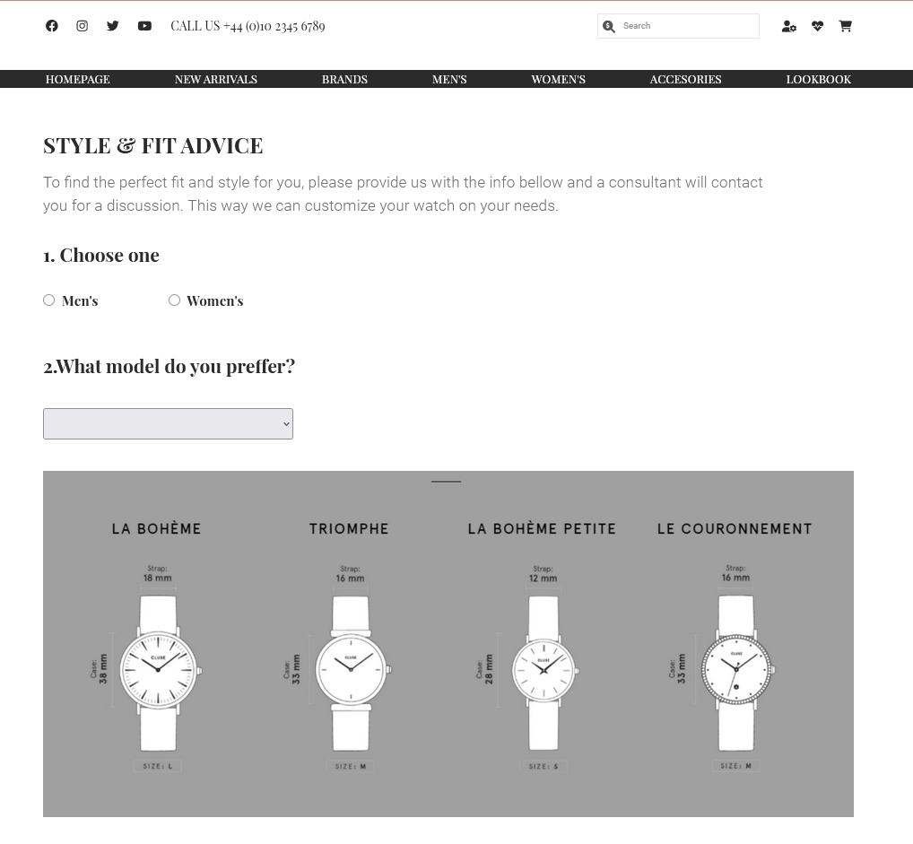

# Pixellab personal project - E-commerce website design

## Overview

This was my first personal project to make for the Pixellab's Frontend Web Development course, that I attended. It represented an e-commerce website for two resolutions (desktop and mobile devices). For this project I've implemented three web pages (Homepage, Style & Advice page, Product page). For the website implementation I've used Next.js framweork and Netlify to publish it online (https://splendid-lebkuchen-d161fd.netlify.app).
Also, the website design was provided by the course trainer.

### The challenge

Users should be able to:

- View the optimal layout depending on their device's screen size
- To access the product page by clicking on a product (which is a unique page for all the products), then to come back on the Homepage, by clicking it from the primary nav bar. Also, to access the Style & Fit Advice.

### Screenshot

HOMEPAGE

PRODUCT PAGE

STYLE & FIT ADVICE PAGE

### Links

- Solution URL: [Github URL](https://github.com/PaulaDuduta/monochrome-responsive)
- Live Site URL: [Netlify homepage](https://splendid-lebkuchen-d161fd.netlify.app)

### Built with

- Semantic HTML5 markup
- CSS custom properties
- Flexbox
- CSS Grid
- Mobile-first workflow
- Next.js
- Bootstrap
- Sass
- Font Awesome

## Author

- GitHub - [@PaulaDuduta](https://github.com/PaulaDuduta)
